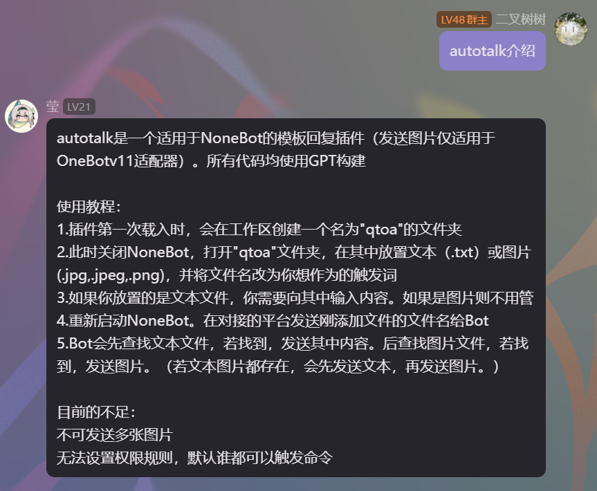

# nonebot-plugin-autotalk
autotalk是一个适用于NoneBot的模板回复插件。**所有代码均使用GPT构建**

## 阅前提醒
 - **此 `README.md` 仅适用于最新的 `Releases`**


## 安装教程
 - 前往最新的Release，下载所有“ `autotalk` 开头的文件”
 - 将下载的“ `autotalk` 开头的文件”放入你的NoneBot的 `plugins` 文件夹即可
   
## 使用教程

### 手动修改
 - 插件第一次载入时，会在BOT根目录创建一个名为 `qtoa` 的文件夹
 - 打开 `qtoa` 文件夹，在其中放置 `文本（.txt）` 或 `图片(.jpg .jpeg .png)`或`语音（.mp3 .wav）` ，并将文件名改为你想作为的触发词
 - 如果你放置的是文本文件，你需要向其中输入内容。如果是其他则不用管
 - 在对接的平台发送刚添加文件的文件名给Bot
 - 若有多个相同名称不同后缀的文件会一起发送

### 通过指令（发送给bot即可）
```关键词帮助

列出所有关键词
添加关键词 (你要添加的关键词)|(你要添加的回答)
添加关键词 (你要删除的关键词)
添加图片关键词 (你要添加的关键词)

```

## 目前的不足
 - 不可发送多张图片
 - 无法设置权限规则，默认谁都可以触发命令
 - 更高级的功能请去尝试lgc233大佬的插件：[NoneBot-Plugin-AutoReply](https://github.com/lgc-NB2Dev/nonebot-plugin-autoreply)

## 例图

