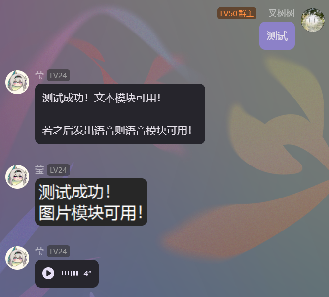

# nonebot-plugin-autotalk
autotalk是一个适用于NoneBot的模板回复插件（发送图片仅适用于OneBotv11适配器）。**所有代码均使用GPT构建**

## 安装教程
 - 前往最新的Release，下载.zip
 - 解压得到两个文件，`__init__.py` 和 `autotalk介绍.txt`
 - 使用nb-cli创建一个新插件，将下载的 `__init__.py` 替换自动生成的同名文件。我的路径在：`...\nonebot\acofork-test\acofork_test\plugins\autotalk\__init__.py`
 - *可以将 `autotalk介绍.txt` 放入插件创建的`qtoa`文件夹，然后向Bot发送 `autotalk介绍` 查看插件效果*
   
## 使用教程
 - 插件第一次载入时，会在工作区创建一个名为 `qtoa` 的文件夹
 - 打开 `qtoa` 文件夹，在其中放置 `文本（.txt）` 或 `图片(.jpg,.jpeg,.png)` ，并将文件名改为你想作为的触发词
 - 如果你放置的是文本文件，你需要向其中输入内容。如果是图片则不用管
 - 在对接的平台发送刚添加文件的文件名给Bot
 - Bot会先查找文本文件，若找到，发送其中内容。后查找图片文件，若找到，发送图片。（若文本图片都存在，会先发送文本，再发送图片。）

## 目前的不足
 - 不可发送多张图片
 - 无法设置权限规则，默认谁都可以触发命令

## 例图

